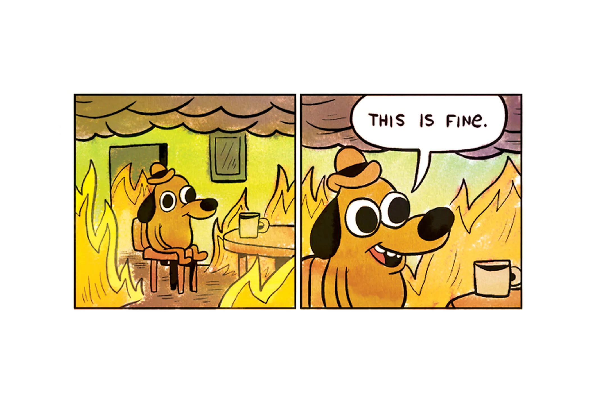
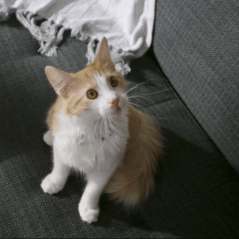

```{r setup, include = FALSE}
library(knitr)
library(tidyverse)
library(NHSRtheme)
library(palmerpenguins)

# set default options
knitr::opts_chunk$set(
	echo = TRUE,
	fig.height = 4,
	fig.width = 7.252,
	dpi = 300
)
# uncomment the following lines if you want to use the NHS-R theme colours by default
# scale_fill_continuous <- partial(scale_fill_nhs, discrete = FALSE)
# scale_fill_discrete <- partial(scale_fill_nhs, discrete = TRUE)
# scale_colour_continuous <- partial(scale_colour_nhs, discrete = FALSE)
# scale_colour_discrete <- partial(scale_colour_nhs, discrete = TRUE)

xaringanExtra::use_tile_view()
xaringanExtra::use_animate_all("fade")
xaringanExtra::use_panelset()
xaringanExtra::use_broadcast()
```

```{r icons, include=FALSE}
ic <- list(
  em = icons::fontawesome$regular$envelope,
  de = icons::fontawesome$solid$desktop,
  gh = icons::fontawesome$brands$github,
  tw = icons::fontawesome$brands$twitter,
  li = icons::fontawesome$brands$linkedin
)
```

class: title-slide, left, bottom

# `r rmarkdown::metadata$title`
----
## **`r rmarkdown::metadata$subtitle`**
### `r rmarkdown::metadata$author`
### `r rmarkdown::metadata$date`

---

# About The Strategy Unit / Me

.pull-left[
***"Leading research, analysis and change from within the NHS"***

**The Strategy Unit** is a specialist **NHS** team, based in [**Midlands and Lancashire CSU**][mlcsu]. We focus on the
application of high-quality, multi-disciplinary analytical work.

Our team comes from diverse backgrounds. Our academic qualifications include maths, economics, history, natural
sciences, medicine, sociology, business and management, psychology and political science. Our career and personal
histories are just as varied.

Our staff are **NHS** employees, animated by **NHS** values. **The Strategy Unit** covers all its costs through project
funding. But this is driven by need, not what we can sell. Any surplus is recycled for public benefit.

[`r ic$de`][su_web] | [`r ic$em`][su_email] | [`r ic$tw`][su_twitter] | [`r ic$gh`][su_github] |
[`r ic$li`][su_linkedin]
]

.pull-right[
**Tom Jemmett**

*Senior Healthcare Analyst*

[thomas.jemmett@nhs.net][tj_email]

- 10+ years experience within the NHS as a data analyst
- BSc Computer Science and Pure Mathematics ([Open University][open_uni])
- [MBCS][bcs]/[AMIMA][ima]
- Active member of NHS-R community
- Senior Fellow of NHS-R academy
- [AphA][apha] member, West Midlands branch champion

[`r ic$em`][tj_email] | [`r ic$tw`][tj_twitter] | [`r ic$gh`][tj_github] | [`r ic$li`][tj_linkedin]
]

---
class: middle, center

# What is Object Orientated Programming?

Let's have a look at a specific example, the `summary()` function.

---

# The `summary()` function

.panelset[

.panel[.panel-name[numeric vector]
```{r}
my_numbers <- rnorm(20)
summary(my_numbers)
```
]

.panel[.panel-name[character vector]
```{r}
my_text <- c("Hello", "World")
summary(my_text)
```

]

.panel[.panel-name[data.frame]
.scroll-panel[
```{r}
summary(penguins)
```
]
]

.panel[.panel-name[linear model]
.scroll-panel[

```{r}
model <- lm(data = drop_na(penguins), body_mass_g ~ flipper_length_mm)
summary(model)
```
]
]
]

---
class: middle, center

# How does `summary()` know how to do different things for different types of data?

---

# A big long list of if's and else's?

``` r
summary <- function(object, ...) {
  if (is.numeric(object)) {
    summary.numeric(object, ...)
  } else if (is.character(object)) {
    summary.character(object, ...)
  } else if (is.data.frame(object)) {
    summary.data.frame(object)
  } else if (is.linear_model(object)) {
    summary.lm(object)
  } else {
    ...
  }
}
```


---
class: middle, center



---

# Is the previous code maintainable?

- `summary()` would need to have an `if` statement for every single different type of data that comes with base R

--

- and every single different type of data that other users have created

--

- and every single different type of data that may be created before the next R release

---
class: middle, center



---

# So how does summary work?

```{r}
get("summary")
```

--

``` r
?UseMethod
```

> R possesses a simple generic function mechanism which can be used for an object-oriented style of programming. Method
> dispatch takes place based on the class(es) of the first argument to the generic function or of the object supplied as
> an argument to UseMethod or NextMethod.

---

# What is a "class"? (in s3)

.panelset[
.panel[.panel-name[numeric vector]
```{r}
class(my_numbers)
```
]

.panel[.panel-name[character vector]
```{r}
class(my_text)
```
]

.panel[.panel-name[data.frame]
```{r}
class(penguins)
```

]
.panel[.panel-name[linear model]
```{r}
class(model)
```
]
]

Every value (or, "object") has one or more classes.

A function like `summary()` is called a generic function which will take an object, look at the objects class(es), and
then look to find a function that matches the first class, e.g. `summary.lm()`.

If it doesn't find a function for the first class, it will move onto the second class.

If it doesn't manage to find a function at all it will try `summary.default()`.

---

# What other generic functions are there?

.pull-left[
The big ones that you will no doubt be using day after day are:

- `c()`
- `plot()`
- `print()` (called any time you type a variable into the console in R<sup>1</sup>)
- `ggplot()`
- most of the `{dplyr}` verbs (e.g. `mutate()`, `select()`, `filter()`)

.footnote[
[1] (sort of)
]
]

.pull-right[

It's also possible to create new generic functions. First, create the "generic" function:

``` r
my_generic <- function(x, ...)
  UseMethod("my_generic")
```

Then, create implementations of this generic for the different types of data you want to support.

``` r
my_generic.data.frame <- function(x, ...)
  do_stuff()
my_generic.lm <- function(x, ...)
  do_other_stuff()
```

]

---

# Can you create your own class of data?

Yes! And it's super easy!

.panelset[
.panel[.panel-name[using a list]
```{r}
my_data <- structure(
  list(
    name = "Tom", works_for = "The Strategy Unit", favourite_food = "🍕"
  ),
  class = "about_me"
)

print.about_me <- function(x, ...) {
  cat("My name is ", x$name, ", and I work for ", x$works_for, ". ",
      "My favourite food is ", x$favourite_food, "\n", sep = "")
}

print(my_data)
```
]

.panel[.panel-name[using a dataframe]
.scroll-panel[
```{r}
my_penguins <- penguins # this is a tibble, which are a superset of data.frame
# prepend our class to the existing classes
class(my_penguins) <- c("my_penguins", class(my_penguins))

print.my_penguins <- function(x, ...) {
  cat("Penguins are awesome! 🐧\n")
  NextMethod() # now call the normal tibble print method
}

print(my_penguins)
```
]
]
]

---

# In Summary:

- s3 is a way to make generic code that works with different types of data, but will produce different results
- s3 works by having a "generic" function which will "dispatch" to the right function based on the "class" of the data
- you can inspect the class of an object using `class(my_obj)`, or set it using `class(my_obj) <- "class"`
- you can create new generic methods by creating a function that uses `UseMethod()`
- you can create implementations of a generic by creating a function named `[generic].[class]()`

---

# What next:

- Go read the OOP chapters in [Advanced-R][advr-oop]
- There are other types of OOP in R
  - s3
  - s4
  - RC/R6
  - ggproto
- I would advice learning s3 and R6 (R6 is far more similar to OOP found in other languages like C++, Java, C#, Python)
- ggproto is only useful if you want to create your own ggplot extensions/work on ggplot

- learn another programming language! See how OOP is different elsewhere! 🙂

---
class: middle, center

# Thanks! Enjoy the rest of the conference!
## join the [NHS-R slack][nhsr-slack]

Extra special thanks to Silvia Canelón ([@spcanelon](https://twitter.com/spcanelon)) for building the `{xaringan}` theme
for the [`{NHSRtheme}`][nhsrtheme] package.

<!-- urls etc. -->
[tj_email]: mailto:thomas.jemmett@nhs.net
[tj_twitter]: https://twitter.com/tomjemmett
[tj_github]: https://github.com/tomjemmett
[tj_linkedin]: https://www.linkedin.com/in/tom-jemmett-3872a8159/

[su_web]: https://strategyunitwm.nhs.uk/
[su_email]: mailto:strategy.unit@nhs.net
[su_twitter]: https://twitter.com/strategy_unit
[su_github]: https://github.com/The-Strategy-Unit/
[su_linkedin]: https://www.linkedin.com/company/the-strategy-unit/

[mlcsu]: https://www.midlandsandlancashirecsu.nhs.uk/

[open_uni]: https://www.open.ac.uk/
[bcs]: https://www.bcs.org/
[ima]: https://ima.org.uk/
[apha]: https://www.aphanalysts.org/

[advr-oop]: https://adv-r.hadley.nz/oo.html
[nhsr-slack]: https://join.slack.com/t/nhsrcommunity/shared_invite/zt-arabo68y-_Uv5uU2dmtfe8mk5ing9Fg

[nhsrtheme]: https://github.com/nhs-r-community/NHSRtheme
